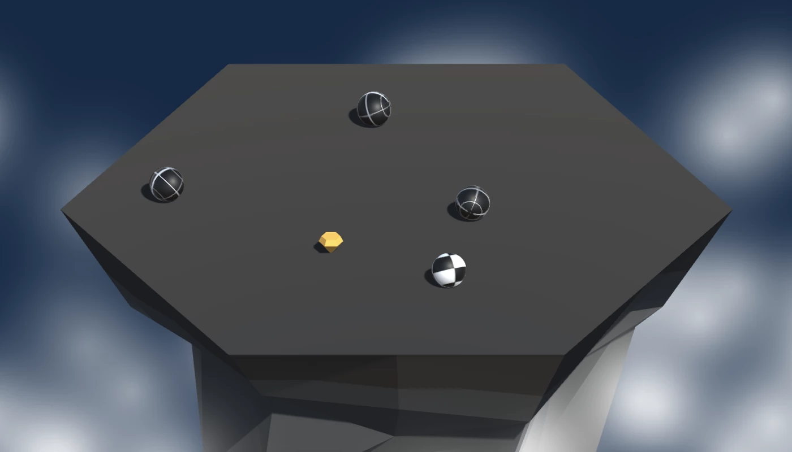

# Overview

In this lesson, we'll be learning how to add simple levels to our game by creating a new wave of opponents each time we successfully clear the island. To do this, we'll learn how to write a `for` loop.

<!-- Don't edit links here, change them in _data/assignment.yml instead, -->

[lesson]: <{{site.data.assignment.lesson}}>     
[slides]:   <{{site.data.assignment.slides}}>   
[template]: <{{site.data.assignment.template}}> 
